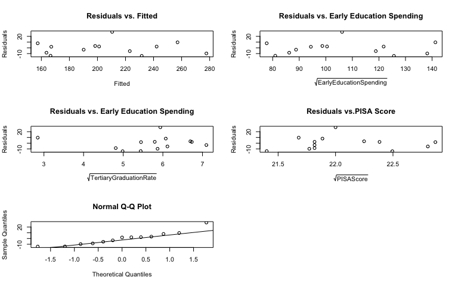

Education Factors Affecting OECD Countries’ Economic Status
================
Jenny Oh
December 20, 2022

# Introduction

What education factors affect OECD countries’ economic status? More
specifically, do education spending in early childhood and tertiary
education, youth NEET rate, population with tertiary education,
secondary and tertiary graduation rate and reading performance affect an
OECD country’s average wage? Education can influence various factors in
society. As a university student who believes one of the main goals of
education is to get a high-paying job, this motivated me to investigate
whether education affects one’s economic status indeed. This can be an
interesting topic to others since education is highly valued in most
countries. It can give valuable insights to those who wonder how
education can impact their lives.

I referenced four research papers to choose the potential educational
factors influencing wealth. The first article by Abdullah et al. (2013)
investigates the relationship between education and income inequality
and gives evidence to use the impact of primary and secondary schooling
as educational factors affecting the average wage. However, the article
focuses on countries in Africa thus the result might differ since the
observations are mostly from the OECD countries. The second article by
Hartog & Oosterbeek (1998) investigates family background as an
educational factor that affects the average wage. Unlike this article,
my research question only addresses wealth but not happiness. The third
article by Andersson et al. (2018) showed how youth who are not in
employment, education, or training (NEET) rate influences their income
in the future. The last article by Martins & Veiga (2010) supports the
relationship between parents’ education and their children’s PISA score.
This article analyzes the relationship between PISA score and parental
socioeconomic status whereas my research focused on the general
relationship between education and income.

Based on the articles above, I included 7 predictors of education
spending in early childhood and tertiary education, NEET rate, the rate
of population with tertiary education, secondary and tertiary graduation
rate, and PISA score to predict the average wage of a country.

# Methods

The dataset is from OECD data and seven variables were chosen to predict
the average wage of a country by fitting a multiple linear regression
model.

First, the data were randomly divided into training and test data with a
7:3 ratio and EDA was conducted to understand the data briefly. Next,
the first regression model was built with the seven variables in the
training set. The assumptions of normality was checked by a QQ-plot and
linearity, homoscedasticity, and uncorrelated error were checked with
residuals/fitted and residuals/predicted plots. The additional
conditions of linear regression were checked by residual plots. If there
was a violation present, transformations were performed and the model
was refitted based on the transformation to satisfy the assumptions.

Then the model was reduced with the t-tests, partial F tests and
multicollinearity. For the t-test, hypothesis tests were conducted for
each estimated coefficient with the null hypothesis of a coefficient
being zero. If the p-value of a test statistic was significant, the
predictor was likely included in the model. Partial F tests were
conducted to check which predictors could be dropped. If the p-value was
not significant, the predictors were dropped and a new model was fitted
with the predictors remaining. Last, multicollinearity was identified by
the VIF (variance inflation factor) and a predictor with a high VIF was
removed to avoid severe multicollinearity.

With the new final model, model validation was performed by checking
problematic points: leverage points, outliers and influential points.
The leverage points were checked by points with high leverage; outliers
by standardized residuals; and influential points by the cook’s
distance, DFFITS, and DF BETAS. Finally, the final model was selected
and compared with different models according to the following criteria:
adjusted *R*2, AIC, Corrected AIC, and BIC.

If there was no further modification needed, the model was validated in
test data with summaries of coefficients, model assumptions and
additional conditions, VIF, and the number of influential points, and
comparing the properties to the fitted model with the training dataset.

The assumptions and the additional conditions of linear regression were
assessed every time new reduced models were fitted and violated
assumptions were mitigated by transformation. The problematic
observations were discovered, and highly correlated predictors were
removed based on the VIF. The assumption and multicollinearity
violations were taken into account and discussed how they would impact
the results.

# Results

The dataset is from OECD data and seven variables were chosen to predict
the average wage of a country. Each country acts as an observation and
the variable in interest is average income. After removing all rows with
N/A values, there are 18 observations and 7 variables in the final
dataset. All variables, including the response variable, are numerical
(Table 1).

| Variable                                           | mean (s.d.) in training     | mean (s.d.) in test     |
|----------------------------------------------------|-----------------------------|-------------------------|
| Average wage                                       | 4.4173^{4} (1.6779^{4})     | 4.9906^{4} (1.2017^{4}) |
| Education spending in early childhood education    | 1.845564^{4} (1.026137^{4}) | 2.231393^{4} (5333.11)  |
| Education spending in tertiary childhood education | 1.166935^{4} (4660.12)      | 1.166203^{4} (6120.28)  |
| NEET rate                                          | 5.158 (2.784)               | 4.096 (2.737)           |
| Population with tertiary education                 | 42.251 (7.921)              | 42.436 (8.878)          |
| Secondary graduation rate                          | 81.949 (6.28)               | 77.555 (5.273)          |
| Tertiary graduation rate                           | 33.34 (10.955)              | 37.089 (6.655)          |
| PISA score                                         | 487.538 (19.869)            | 495.2 (7.596)           |

Summary statistics in training and test dataset

When checking the assumptions, normality and uncorrelated error seemed
to be violated since there were clusters separated from the rest for
tertiary education spending and secondary education rate variables and
the values were not aligned in the QQ-plot. Therefore, the data was
transformed based on the result from power transformations and the
predictor and response variables were transformed by square root. The
newly fitted model reasonably satisfied the conditions and assumptions
with *R*2 = 0.950 although normality was still slightly
violated.

According to the t-tests and partial F-tests, a new linear model was
fitted with predictors of education spent on tertiary and early
education, tertiary graduation rate and the PISA score. So the model
ended up involving only four predictors with the *R*2 = 0.948
indicating that only a little information was lost by removing these
predictors.

However, there was severe multicollinearity present for two predictors
in the reduced model. Therefore, the model was refitted without tertiary
education spent (VIF = 6.292) as it seemed highly related to the
tertiary graduation rate (VIF = 3.533). The resulting model was free
from severe multicollinearity and had a comparable R-squared
(*R*2 = 0.919) value to the initial full and the reduced
model.

The goodness of the final model was assessed by the following criteria:
adjusted *R*2, AIC, Corrected AIC, and BIC. It was found that
both of the reduced models explain the data better than the first model
with seven predictors (Table 2). Although the reduced model with 4
predictors has a slightly smaller AIC, corrected AIC, BIC value and
greater adjusted *R*2 than the final model, multicollinearity
was present and thus cannot be used as the final model. Therefore, the
best-fitting model was concluded to be the final reduced model.

| Model                                 | Adjusted *R*2 | AIC    | Corrected AIC | BIC   |
|---------------------------------------|--------------------------|--------|---------------|-------|
| Full model                            | 0.88                     | 227.02 | 263.02        | 236.1 |
| Reduced model with 4 predictors       | 0.92                     | 64.48  | 74.98         | 71.87 |
| Final reduced model with 3 predictors | 0.89                     | 68.12  | 74.79         | 74.95 |

Summary of goodness measures for models fit to square root of average
wage. The variables that were included in the final reduced model were
square roots of average wage, education spending in early
childhood,tertiary graduation rate and reading performance PISA score.

Moreover, influential and problematic points, violated assumptions, and
the presence of complicated transformations were used to validate the
final model. For the problematic points, one leverage point was
identified as distant from the rest of the observations in the predictor
space. There was one outlier identified when considering the dataset as
small. There was one observation that was identified as being
influential on the entire regression surface, one observation that
influenced their own fitted values and between 0-2 observations being
influential on at least one estimated coefficient. The model assumptions
and the additional conditions were reasonably satisfied although the
normality appears to be still slightly violated (Appendix 1 & 2). The
model only used a non-complicated transformation of root-square.

-   **Plot 1**: Verifying the Model Assumptions of the Training Model.
    Residuals vs. Fitted plots and Residuals vs. Predictor plots for
    constant variance and independence, and normal QQ-plot for
    normality.

<!-- -->

-   **Plot 2**: Verifying the Model Assumptions of the Test Model.
    Residuals vs. Fitted plots and Residuals vs. Predictor plots for
    constant variance and independence, and normal QQ-plot for
    normality. Normality seems to be slightly violated here as well.

<!-- -->

For validation, the final model was compared to the test dataset with
estimated regression coefficients, significant predictors, model
violations, adjusted *R*2, problematic observations and the
presence of multicollinearity. While both models had similar largest VIF
values, the numbers of problematic observations seem to be different
(Table 3). Moreover, normality of both models seems to be slightly
violated while the other assumptions and the additional conditions were
reasonably satisfied (Plot 1 & 2). The coefficient for the intercept and
the predictors were significantly different between the two models.
While all predictors in the trained model were fairly significant, none
of the coefficients in the test model were significant. Therefore, the
model failed to be validated based on the results.

| Characteristic           | Final Model (Train)     | Final Model (Test) |
|--------------------------|-------------------------|--------------------|
| Largest VIF value        | 1.3                     | 1.269              |
| # of Cook’s D            | 1                       | 2                  |
| # of DFFITS              | 1                       | 0                  |
| Violations               | normality, independence | normality          |
| —————                    | —————                   | —————              |
| Intercept                | 336.72 ± 190.21         | 560.64 ± 2301.43   |
| Early Education Spending | 1.99 ± 0.2 (\*)         | 0.37 ± 0.69        |
| Tertiary Education       | 9.36 ± 4 (\*)           | 32.44 ± 34.67      |
| PISA Score               | -17.85 ± 9.09(.)        | -25.83 ± 105.59    |

Summary of characteristics of the final model in the training and test
datasets. The final uses ‘early education spending’, ‘tertiary education
rate’, and ‘PISA score’ as predictors and the response is square root of
average wage. Coefficients are presented as estimate ± SE (\* =
significant t-test at *α* = 0.05 and . = significant t-test at
*α* = 0.1).

# Discussion

The final model fitted with the training data indicates that early
education spending (*β*1 = 1.99), tertiary education rate
(*β*2 = 9.36), and PISA score (*β*3 = -17.85) were
linearly associated with the average income of a country. In contrast,
the final model fitted with the test data had significantly different
coefficients (Table 3). The coefficients can be interpreted as the
average income of a country is expected to increase by 1.99 in the
training model and 0.37 in the test model for one unit increase in early
education spending when the other predictors are held fixed. Therefore,
the results answer the research question by showing that out of the
seven potential predictors, early education spending, tertiary education
rate and the PISA score affect OECD countries’ economic status. However,
since the model failed to be validated, the interpretation is likely to
be flawed.

There are several limitations to this analysis. First, the assumptions
of normality based on the QQ-plot were unable to be perfectly remedied
through transformations since there was no simple transformation that
fixes the violation. The lack of normality means that p-values for our
hypothesis tests could not be reliable. Therefore, it is possible that
the model-building process based on hypothesis tests was flawed and
could have resulted in a different model. Moreover, there was a small
number of observations of 18 in the dataset and it led to the
significant differences between the coefficients and their significance
between the train and the test model. Due to the nature of limited
observations in data, there was not much variation present. It was not
allowed to go back and randomly select another training and test dataset
since the model was already fitted. Since there were influential
observations for both models, the coefficients might have been impacted
by them as well.

# Bibliography

Abdullah, A., Doucouliagos, H., & Manning, E. (2013). Does education
reduce income inequality? A meta-regression analysis. Journal of
Economic Surveys, 29(2), 301–316. <https://doi.org/10.1111/joes.12056>

Andersson, F. W., Gullberg Brännstrom, S., & Mörtvik, R. (2018).
Long-term scarring effect of neither working nor studying. International
Journal of Manpower, 39(2), 190–204.
<https://doi.org/10.1108/ijm-12-2015-0226>

Hartog, J., & Oosterbeek, H. (1998). Health, wealth and happiness: Why
pursue a higher education? Economics of Education Review, 17(3),
245–256. <https://doi.org/10.1016/s0272-7757(97)00064-2>

Martins, L., & Veiga, P. (2010). Do inequalities in parents’ education
play an important role in Pisa students’ mathematics achievement test
score disparities? Economics of Education Review, 29(6), 1016–1033.
<https://doi.org/10.1016/j.econedurev.2010.05.001>

OECD. (2022). Earnings and wages - average wages - OECD data. theOECD.
Retrieved December 19, 2022, from
<https://data.oecd.org/earnwage/average-wages.htm>

OECD. (2022). Education at a glance. OECD iLibrary. Retrieved December
19, 2022, from
<https://www.oecd-ilibrary.org/education/education-at-a-glance_19991487>

OECD. (2022). OECD Employment Outlook 2022. OECD Employment Outlook.
<https://doi.org/10.1787/1bb305a6-en>

OECD. (2022). Pisa. Digital Object Identifier System. Retrieved December
19, 2022, from <https://doi.org/10.1787/19963777>

# Appendix

**1.**

<!-- -->

**2.**

<!-- -->
